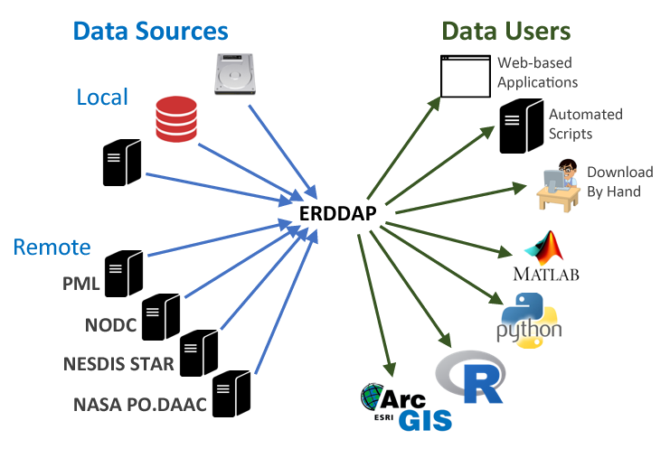

# Introduction
>notebook filename | 01-Introduction.Rmd  

## What is ERDDAP

For many users, obtaining the ocean satellite data they need requires downloading data from several data providers, each with its own file formats, download protocols, subset abilities, and preview abilities.
   
> **A short list of ocean satillite data providers**   
Jet Propulsion Laboratory PO.DAAC  
Ocean Biology (OB.DAAC)  
Goddard Space Flight Center  
Center for Satellite Applications and Research  
CoastWatch Central Operations  
Office of Satellite and Products  
National Centers for Environmental Information  
Comprehensive Large Array-data Stewardship System  
European Space Agency  
Japan Aerospace Exploration Agency   

The goal behind ERDDAP is to make it easier for you to get scientific data. To accomplish that goal, ERDDAP acts as a middleman, selectively channeling datasets from remote and local data sources to a single data portal. With ERDDAP as the single-source portal, you have access to a simple, consistent way to download subsets of gridded and tabular scientific datasets in common file formats, with options and make graphs and maps.

  

*Features of ERDDAP*  

* Data in the common file format of your choice. ERDDAP offers all data as .html table, ESRI .asc and .csv, Google Earth .kml, OPeNDAP binary, .mat, .nc, ODV .txt, .csv, .tsv, .json, and .xhtml  

* ERDDAP can also return a .png or .pdf image with a customized graph or map  

* Standardized  dates/times ("seconds since 1970-01-01T00:00:00Z" in UTC)  

* A graphical interface for humans with browsers   

* RESTful web services for machine-to-machine data exchange and downloading data directly into your software applications (e.g.Matlab, R, Python...) and even into web pages.

## Tuturials on how to use ERDDAP servers  
* [Using the ERDDAP data catalog](lessons/md/02-Catalog.md)  
* [Visualize data](lessons/md/03-Visualize.md)  
* [Understanding the ERDDAP URL](lessons/md/04-Erddapurl.md)  
* [Creating a Hovmoller plot](lessons/md/05-Hovmoller.md)  
* [Working with wind vectors](lessons/md/06-Vectors.md)  
* [Using tabular data](lessons/md/07-Tabledap.md)  
* [Additional resources](lessons/md/08-Resources.md)   

## List of ERDDAP servers  

ERDDAP has been installed by over 70 organizations worldwide.  

__CoastWatch__  

* CoastWatch West Coast Node https://coastwatch.pfeg.noaa.gov/erddap/
* CoastWatch Central Pacific Node https://oceanwatch.pifsc.noaa.gov/erddap/
* CoastWatch Gulf of Mexico Node https://cwcgom.aoml.noaa.gov/erddap/
* CoastWatch Great Lakes Node https://coastwatch.glerl.noaa.gov/erddap/
* CoastWatch Central https://coastwatch.noaa.gov/erddap/  

__Other organizations__  

* Southern California Coastal Ocean Observing System http://sccoos.org/erddap/
* Rutgers http://tds.marine.rutgers.edu/erddap/
* NOAA GEO-IDE UAF https://upwell.pfeg.noaa.gov/erddap/
* NCEI https://www.ncei.noaa.gov/erddap/
* French Research Instutute http://www.ifremer.fr/erddap/
* Marine Institute Ireland https://erddap.marine.ie/erddap/  

A more complete list is available at the following link:  
https://coastwatch.pfeg.noaa.gov/erddap/download/setup.html#organizations  

  [CoastWatch](https://coastwatch.noaa.gov/)
