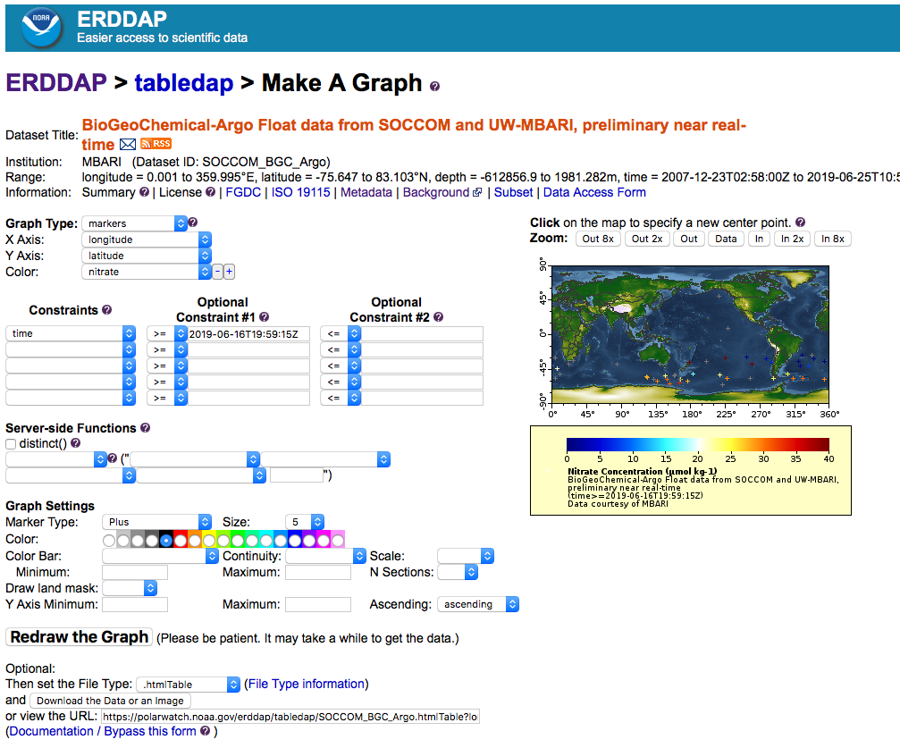
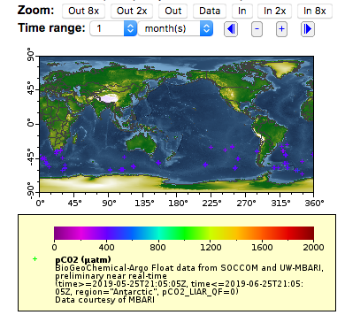
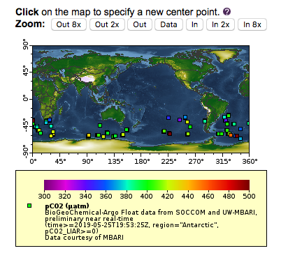
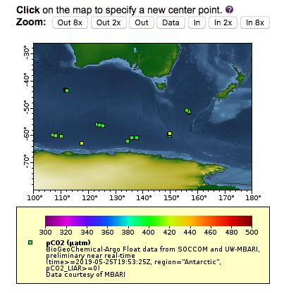
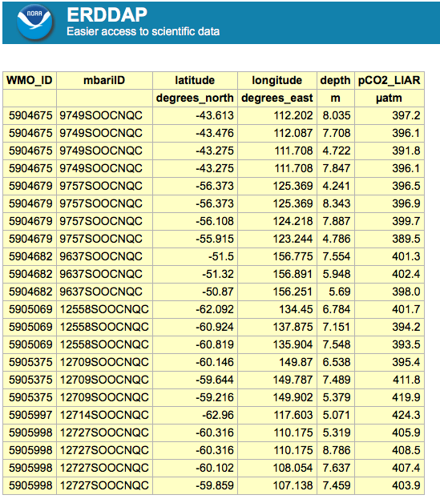
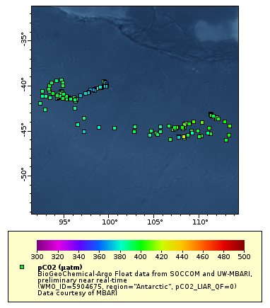
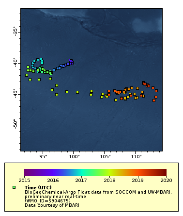
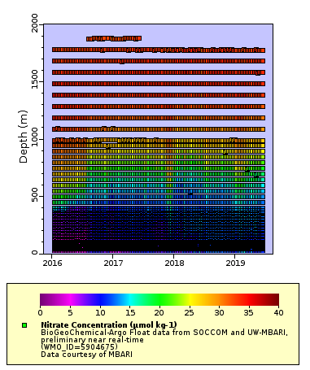
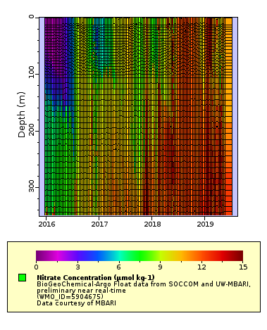

# Tabular Datasets, BGC-Argo data

There are two types of data in ERDDAP, gridded data and tabular data. So far all of our examples have been with gridded data.  Working with tabular data is a little different.  Here we will explore the Biogeochemical-Argo (BGC-Argo) dataset, which is hosted on the PolarWatch ERDDAP.

## Searching for the BGC-Argo datasets   

* Enter the following URL into your browser to bring up the PolarWatch ERDDAP: `https://polarwatch.noaa.gov/erddap/` 

* In the search box type "Biogeochemical-Argo" and click the "Search' button  

In the search results, two datasets are displayed: the near-real-time dataset (Dataset ID: SOCCOM_BGC_Argo), and a science quality dataset that is updated quarterly (Dataset ID: BGC_Argo_Snapshot_Archive).   

  

We will work with the near-real time dataset, so click `"graph"` to the left of the near real-time dataset. 

 

By default the map displays all the float locations for the last 10 days.  The locations are color coded by their Nitrate concentration. 

## Subsetting the area and selecting a date   

Let's make a map of all floats in Antarctica which have pCO2 data and that have reported in the for a one month time period from May 25, 2019 to June 25, 2019.   

The `“Make A Graph”` page works slightly differently for the tabular datasets than it does for gridded datasets. For tabular datasets, the subsetting is done by the widgets listed under "Constraints" (for gridded datasets they are classified under "Dimensions"). 

* Select `"time"` as a constraint and set `"Optional Constraint #1"` to `2019-05-25T21:05:05Z`. Make sure that the dropdown item to the left of `"Optional Constraint #1"` is set to `">="` (i.e all dates greater than or equal to May 25, 2019). Set `"Optional Constraint #2"` to `2019-06-25T21:05:05Z`. Make sure that the dropdown item to the left of `"Optional Constraint #1"` is set to `"<="` (i.e all dates less than or equal to June 25, 2019).  
* Change the parameter selected next to `"Color"` at the top of the page from `"nitrate"` to `"pCO2_LIAR."` pCO2_LIAR is calculated partial pressure of carbon_dioxide in sea_water.  
* pCO2_LIAR has a quality flag (`pCO2_LIAR_QF`) to indicate which data points are good and which are not. The values for the flag are 0=Good, 1=Missing or not inspected, 4=Questionable, 8=Bad". Select `"pCO2_LIAR_QF"` as a constraint and enter `0` in `"Optional Constraint #1`". Make sure that the dropdown item to the left of `"Optional Constraint #1"` is set to `"="` (i.e all values that are good).  
* This dataset has `"Region"` as a parameter, and we can use that to get just data from Antarctic.  Select `"region"` as a constraint and select `"Antarctica"` from the dropdown widget menu  
* Next click the `"Redraw the Graph"` button.  

 

## Adjusting the map display

The scale for the pCO2 goes from 0-2000 uatm, but the data on the map seems to be between 300-500 uatm. In addition, the markers on the map are plus signs, which are hard to see. Let's change the display to make the data easier to see. 

* Under `"Graph Settings"`, set the `"Marker Type"` dropdown to `"Filled Square`."
* Below `"Color Bar"`, type `300` in the `"Minimum"` box and `500` in the `"Maximum"` box.  
* Next click the `"Redraw the Graph"` button. 

 

## Navigating around the map

Now lets zoom in on the region around Australia. 

* Select longitude as a constraint and `100` as `"Optional Constraint #1"`. Make sure that the dropdown item to the left of `"Optional Constraint #1"` is set to `">="`. Set  `180` as `"Optional Constraint #2`. Make sure that the dropdown item to the left of `"Optional Constraint #2"` is set to `"<="`. 
* Click the `"Redraw the Graph"` button.  
 

## Subsetting the Data 

What floats are we seeing?  We can find this out by looking at the data itself.  

* Click the `"Data Access Form"` above the map  

This brings us to a new page which shows all the variables in the dataset, and allows constraints to be set on all of them. Constraints from the previous page have been retained. 

* Check the boxes next to `"WMO_ID"` and `"mbariID"` at the top of the list.
* Check the boxes next to `"depth"` and add <=10 as an as `"Optional Constraint"` for depth to limit the number of results per profile. 

* Click the `"Sumbit"` button at the bottom of the page.  

 

## Visualize the buoy track  

__Now lets make a map of the complete trajectory for one of these floats, color coded by time.__  

* Use the browser back button to return to the `"Data Access Page"`
* Click on the '"Make a graph"' link under the dataset title 
* Remove the time and longitude constraint
* The select a single buoy, identify it with the WMO ID. Select `"WMO_ID"` as a constraint and select `5904675` from the dropdown box that shows all of the buoys that adhere to all of the other constraints.
* Click the `"Redraw the Graph"` button.  

The map shows the pCO2 values along the entire buoy track. 

__We can also pot the use the `"Color"` widget to plot the time for each of the symbols on the map.__    

* Change the parameter selected next to `"Color"` at the top of the page from `"pCO2_LIAR"` to `"time"`
* Remove the minimum (300) and maximum (500) values from underneath the '"color bar"' in '"Graph Settings'" 
* Then click the `"Redraw the Graph"` button.  

The color bar is now time and color of marker indicate the date the the buoy of in a location. 

## Visualize the buoy section of depth profiles  

__Let's make a section of Nitrate for this float.__ 

* Under '"Graph Type'" at the top of the page select '"time"' as the '"X Axis"', '"depth"' as the '"Y Axis"' and '"Nitrate"' as the '"Color"'
* Then click the `"Redraw the Graph"` button.  

__The data is upside-down and not much detail can be seen in the surface so lets fix those issues.__  

* Under '"Graph Settings'" set the `"Y Axis Minimum"` to `0`, the `"Y Axis Maximum"` to `350` and change  `"Ascending"` to `"descending"`. 
* Change the Marker Size to `"10"` 
* Under `"Color Bar"`, set `"Maximum"` to `15`. 

  

  [CoastWatch](https://coastwatch.noaa.gov/)
